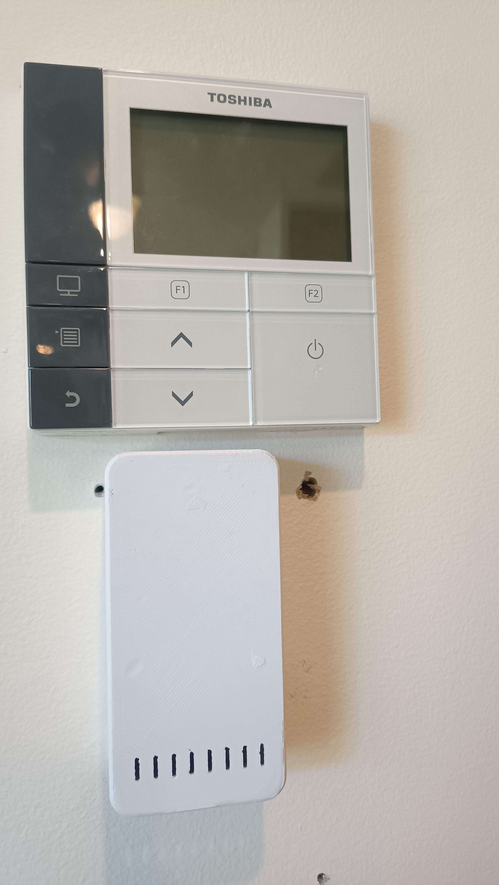
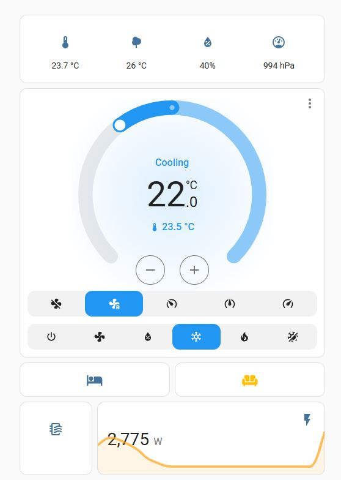
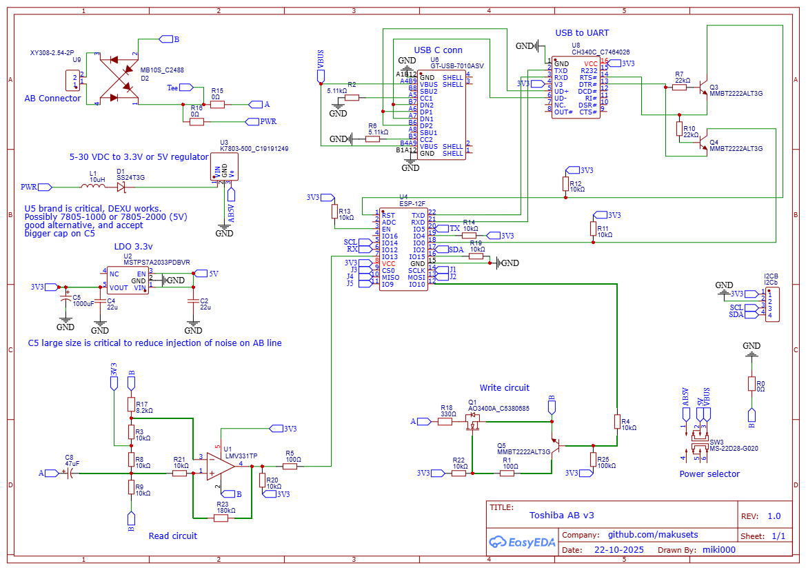
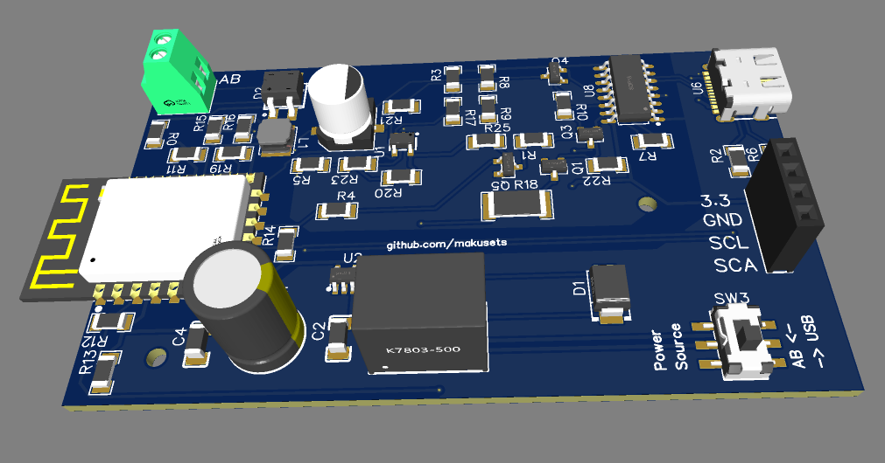
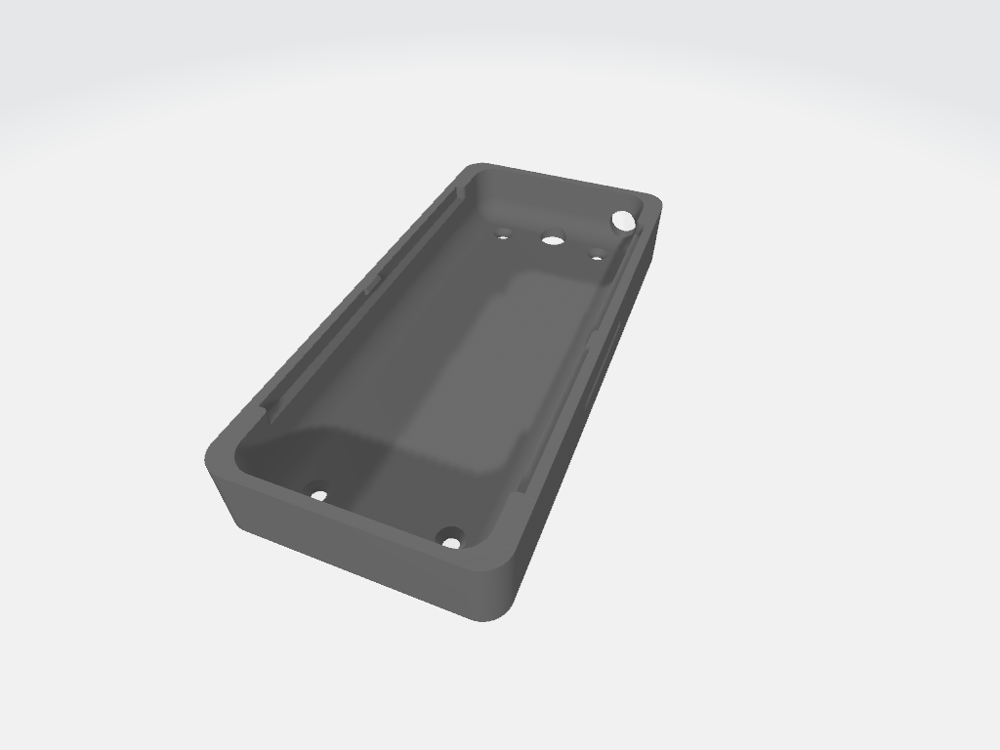

# Updated code (Jan 2026)
- Added the option of using the board without any other controller or wall remote. Details in "complete_example.yaml"
- Added the option of changing read/write codes needed for some comercial systems.
- Added the option of a filter alert sensor.
- Refined protocol reading to include variations, specifically frames preceded by 0xF0 0xF0 and followed by 0xA0 at the end.
- Removed filters that prevented some messages from being read.
- Improved logs.
- Other small changes.

# v3 is here!
v3 board is here (v2 never saw the light)

Improvements over v1:
- Works with a wide voltage range in the AB line (v1 only worked within a very narrow voltage window on the AB line), which should expand compatibility to more toshiba models.
- Much better filtering of noise and virtually no noise introduced on the AB line.
- Robust comparator design for data processing with DC filtering capacitor.
- Selectable power source with slide switch: AB line or USB. Only switch power source with the board completely disconnected, otherwise there is high risk of damaging the circuit. USB data will operate even with AB power. 

notes:

- The ESP consumes a lot more energy than the conventional wall remotes due to Wi-Fi. Therefore, the board is powered using a buck converter, as opposed to the LDO used in original Toshiba wall remote. This has the potential of introducing noise and interfere with data transmission. Through testing, I found that the specific make and model of the buck had a big impact on data corruption; as well as a good size capacitor on the 3.3v rail (at least 1000uF). This design has been tested with a DEXU branded buck,both K7803-500 and K7803-1000 and works without issues. If you test other components, please let me know what you found out.
- The DCDC buck provides 3.3V and then is fed into a 3.3V LDO, although this is counterintuitive, the LDO reduces noise further and is needed for USB power anyway, the specific model chosen allows for 3.3V input. 
- The data reading is done using DC filtering and then a comparator. The size of the DC filter capacitor is important. 
- The writing is done by pulling the A line low (to B) across a 330ohm resistor for a "0" bit, this is the same approach adopted by toshiba original board.


# ESPHome Toshiba_AB AC Component

     


ESPHome component to integrate with Toshiba Air Conditioners using the two wire AB line connection to remote.

This project implements all necessary functions to decode and interact with the Toshiba TCC protocol over the AB line. It interprets and reports all messages between remote controllers and central unit and sends commands as it was the wall remote.

The hardware side of this project includes a ESP12 based board design that connects to the system.

In particular, this project has been tested with remote control unit RBC-AMT32E and RBC-AMT54E and central unit RAV-SM1103DT-A but should work with other models using the AB protocol.


Requires reader & writer circuit to interface with the AB line, connected to the remote AB ports. 
The circuit board was designed in easyEDA and all necessary files are included here.

Most of the work is based on previous work from @muxa: https://github.com/muxa/esphome-tcc-link
and the hard bits of decoding and initial board design by @issalig https://github.com/issalig/toshiba_air_cond


## To install, add or modify these sections in your esphome device yaml file

```yaml

logger:
  baud_rate: 0  #disable hardware UART log to use pins for UART communication with the AC unit 
  level: DEBUG

external_components:
  - source:
      type: git
      url: https://github.com/makusets/esphome-toshiba-ab
    refresh: 0s  #optional, how often to download fresh files from source, defaults to 1 day, use 0 to force updates 

uart:
  tx_pin: GPIO10  #GPIO15 if using v1 board
  rx_pin: GPIO13
  baud_rate: 2400
  parity: EVEN
  rx_buffer_size: 2048    # increase buffer to avoid dropped bytes

climate:
  - platform: toshiba_ab
    name: "Toshiba AC"
    id: toshiba_ac
    connected:
      name: "Toshiba AC Connected"  # optional, binary sensor that monitors link with AC
    master: 0x00 # Master ID in Toshiba protocol, optional, if omitted will go into autodetect
```

## Optional section if you install a BME280 sensor

The option of a BME280 sensor is added to give the option of reading the temperature, pressure and humidity from the thermostat. It is done as any other sensor in the ESPHome environment. If configured, it will be exposed to the frontend. If you want to use this or another sensor to control the AC system, have a look at the complete_exmple.yaml file. 

```yaml
# If installed, it will report the BME280 temp, humidity and pressure values

i2c:
  sda: GPIO2
  scl: GPIO14
  scan: True


sensor:
  - platform: bme280_i2c
    temperature:
      name: "Indoor Temperature"
      id: bme_temp
      oversampling: 1x
    pressure:
      name: "Indoor Pressure"
      id: bme_pressure
      accuracy_decimals: 0
      oversampling: 1x
    humidity:
      name: "Indoor Humidity"
      id: bme_humidity
      accuracy_decimals: 0
      oversampling: 2x
    address: 0x76
    update_interval: 30s
    
```

# Hardware installation

You will need to build the esphome compatible hardware. Instructions below.

- Most likely, the first time, you will have to flash the board with the firmware via USB, typical ESPHome process. Once working, OTA updates will work.

- Isolate the AC unit completely off (at the electrical distribution board ideally)
- Take out the cover of your remote controller
- Loose the screws of AB terminals. 
- Wire the remote A,B terminals to the pcb. V1 board is polarity sensitive. V3 board can be connected both ways.


# Hardware design

This is the schematic of the V3 board, it is powered by the AB line




It should look something like this:




I2C headers have been added for the BME280 I2C sensor option, also for future inclusion of a screen or other I2C device
If a BME280 sensor is installed and setup in yaml it will report the readings to HA

All files necessary can be found in the hardware folder, including the EasyEDA Project:

https://github.com/makusets/esphome-toshiba-ab/tree/main/hardware

# Case

A suitable enclosure for the board was designed to be 3D printed in two parts, STL files are available in the hardware folder. The case was designed using OnShape online designing software, the original file is public and can be found and modified by searching "toshiba_esp_case" within OnShape environment. The case looks like this:
 


# More options and complete yaml

Have a look at the complete_example.yaml file for more options available for the component. It includes details about reporting a chosen temperature to the AC central unit or reading extra sensors (power, pressure, runtime, temp...)
