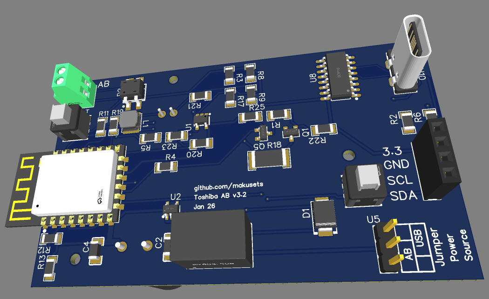
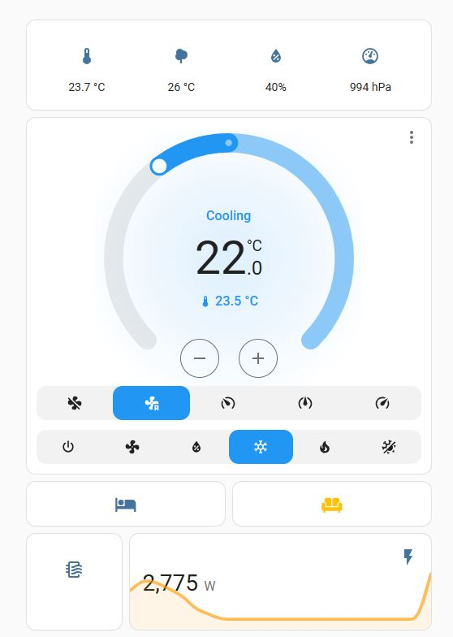

# ESPHome Toshiba AB

ESPHome hardware and component support for Toshiba central air-conditioning and
ESTIA hydronic heat-pump systems that communicate over the two-wire **AB bus**.

> This project is not suitable for most split systems that are controlled only
> by an infrared remote.

 

## Changelog

### July 2026 — ESTIA R410A support

Thanks to [@JuhaniVu](https://github.com/JuhaniVu), the first-generation Toshiba
ESTIA R410A frame format is fully implemented. Select `frame_format: estia` and
use a 2400 baud, 8N1 UART (`parity: NONE`). See the
[complete R410A configuration](estia_R410A.yaml).

### May 2026 — ESTIA R32 and protocol improvements

Thanks to [@7tobias](https://github.com/7tobias), Toshiba R32 ESTIA Series 1
systems are supported. The component can detect the normal TCC-Link, HM and
ESTIA R32/A0 formats, and address assignment avoids duplicate-address E09
errors. Thanks to [@mtthidoteu](https://github.com/mtthidoteu), HM-format support
and hardware UART operation improve compatibility and stability.

### January 2026 — autonomous mode

The component can operate without another wall controller, supports configurable
commercial-system read/write command modes and a filter-alert sensor, and has
more robust frame handling and logging. See the relevant complete YAML example
below for the optional settings.

### Hardware releases

- **v3.2:** revised UART pins, a 3300 µF 3.3 V rail capacitor, easier-to-solder
  USB-C, boot/reset buttons, a power-selection jumper and easier assembly.
- **D1 mini:** a simpler board designed with
  [@issalig](https://github.com/issalig), using RX D7 and TX D8.
- **v3:** wider AB-line voltage range, improved filtering, a comparator-based
  receiver and selectable AB/USB power.

## About this project

The component decodes traffic between a Toshiba indoor unit and its wired remote,
reports the system to ESPHome/Home Assistant, and sends commands as a wall remote
would. It supports:

- conventional **air-to-air systems** using classic TCC-Link, its HM variation,
  or the now fully functional TU2C protocol;
- **ESTIA hydronic systems**, including tested R410A and R32 generations;
- operation alongside a wall remote or, where supported, autonomous operation.

The hardware is an ESP8266/ESP-12 interface board designed in EasyEDA. It powers
from the AB line (or USB for initial flashing only, no comms) and converts the AB bus to
UART safely. **Do not connect the AB terminals directly to an ESP UART.**

### Hardware requirements and application range

You need a supported ESPHome board/interface from the [`hardware`](hardware/)
folder (or an electrically equivalent reader/writer circuit), access to the
unit's wired **A/B remote terminals**, and an ESPHome/Home Assistant installation.
The current board has been used with Toshiba central/commercial HVAC, multi-split
indoor units that expose an AB wired-controller connection, and ESTIA heat pumps.

Model names are useful hints, not guarantees: Toshiba has used different
protocols within related product ranges. Confirm that your unit has an AB port,
then use the selection tables below and the
[protocol/frame-format reference](docs/frame_formats.md).

<details>
<summary><strong>Hardware design, construction, installation and case</strong></summary>

The recommended v3.2 board includes AB-line power conversion, noise filtering,
a comparator receiver and a transistor writer. Isolate the HVAC system before
opening a controller or changing AB wiring. Select USB power for initial flashing
and AB power only after USB power has been disconnected.

Board fabrication files, schematics, bills of materials, assembly advice,
installation steps and enclosure details are collected in the
[hardware guide](docs/hardware.md). Go directly to a board revision:

- [v3.2](hardware/v3.2/README.md) — recommended full board
- [D1 mini](hardware/D1%20mini/README.md) — simpler modular variant
- [v3](hardware/v3/README.md) and [v1](hardware/v1/README.md) — older revisions
- [all hardware and printable case files](hardware/)

</details>

<details>
<summary><strong>Air-to-air systems (conventional air conditioning)</strong></summary>

### Choosing a protocol

Air-to-air units use one of three supported AB protocol variations:

| Variation | Typical systems and examples | UART | `frame_format` |
| --- | --- | --- | --- |
| **TCC-Link** | Most established central/commercial systems. Tested examples include indoor `RAV-SM1103DT-A` and `MMD-AP0366BHP1-E` with `RBC-AMT32E`/`RBC-AMT54E` controllers; repository reports also include `RAV-SM802BT-E`. | 2400 baud, **8E1** (`EVEN`) | `auto` (recommended) or `normal` |
| **HM (TCC-Link variation)** | Newer RAV-HM/RAV-RM systems. Examples reported in this repository include `RAV-RM801BTP-E` + `RAV-GM801ATP-E`, `RAV-RM801KRTP-E`, and `RAV-HM561KRTP-E`. HM retains TCC-Link semantics but uses a different envelope. | 2400 baud, **8E1** (`EVEN`) | `auto` or `hm` |
| **TU2C** | Common in newer **U-series** systems; examples include `RAS-M16U2MUVG`, `RAS-M24U2DVG-E` and `M07U2DVG-E`. TU2C support is fully functional, but it is not auto-detected. | 2400 baud, **8N1** (`NONE`) | `tu2c` |

Some Toshiba documentation describes changing a TU2C-capable unit back to
TCC-Link through its main board or DN code `FC`; do not assume this is available
on every model. Prefer the unit's native protocol unless its service manual says
otherwise. For byte-level differences, aliases and detection behavior, read
[Toshiba AB protocol frame formats](docs/frame_formats.md).

### Minimal ESPHome configuration

This is the complete component-specific portion for TCC-Link/HM. Add your normal
ESPHome device, Wi-Fi, API and OTA sections. For TU2C, change both highlighted
settings to `parity: NONE` and `frame_format: tu2c`.

```yaml
logger:
  baud_rate: 0

external_components:
  - source: github://makusets/esphome-toshiba-ab

uart:
  tx_pin: GPIO12       # GPIO10 on v3; GPIO15 on v1; D8 on D1 mini
  rx_pin: GPIO13       # D7 on D1 mini
  baud_rate: 2400
  parity: EVEN         # NONE for TU2C
  rx_buffer_size: 2048

climate:
  - platform: toshiba_ab
    name: "Toshiba AC"
    id: toshiba_ac
    frame_format: auto # use tu2c for TU2C systems
```

See [`complete_example.yaml`](complete_example.yaml) for autonomous operation,
addresses, temperature reporting, diagnostic sensors, power estimation and all
other air-to-air options. [`example.yaml`](example.yaml) is a ready-to-edit,
smaller device configuration.

### Optional BME280

The boards expose I²C so a BME280 can publish local temperature, humidity and
pressure. Its temperature can also be sent to the air conditioner as the room
temperature. The relevant I²C, sensor and `report_sensor_temp` YAML belongs in
the example configuration rather than this overview; see
[`complete_example.yaml`](complete_example.yaml).

</details>

<details>
<summary><strong>Hydronic systems (Toshiba ESTIA)</strong></summary>

### Tested generations and protocols

ESTIA changed protocol between the R410A and R32 generations. Both are supported,
but their UART parity and frame-format settings are not interchangeable.

| Generation | Protocol | Example/tested models | UART | `frame_format` |
| --- | --- | --- | --- | --- |
| **R410A / first generation** | First-generation ESTIA, TU2C-style wrapped frames | R410A ESTIA systems using first-generation wired controllers | 2400 baud, **8N1** (`NONE`) | `estia` (must be explicit) |
| **R32** | ESTIA A0 protocol | Series 1 `HWT-1101HRW-E` outdoor + `HWT-1101XWHT9W-E` indoor; `HWT-1102S21SM3W-E` is also reported in the repository | 2400 baud, **8E1** (`EVEN`) | `a0` |

R32/A0 provides bidirectional power, heat/cool mode and setpoint control,
autonomous temperature/runtime polling, optional 0–10 V demand-interface
emulation, runtime sensors and command retries. First-generation support includes
the R410A status, setpoint, Zone 1 and domestic-hot-water controls documented in
its complete example. See the [protocol reference](docs/frame_formats.md) and
[first-generation ESTIA protocol notes](docs/estia_first_gen_protocol.md) for
technical detail.

### Minimal R410A configuration

```yaml
uart:
  tx_pin: GPIO15
  rx_pin: GPIO13
  baud_rate: 2400
  parity: NONE

climate:
  - platform: toshiba_ab
    name: "Toshiba Estia R410A"
    frame_format: estia
```

Use [`estia_R410A.yaml`](estia_R410A.yaml) for the complete R410A configuration.

### Minimal R32 configuration

```yaml
uart:
  tx_pin: GPIO15
  rx_pin: GPIO13
  baud_rate: 2400
  parity: EVEN

climate:
  - platform: toshiba_ab
    name: "Toshiba Estia R32"
    frame_format: a0
```

Use [`example_estia.yaml`](example_estia.yaml) for the complete R32 configuration,
including optional demand emulation, sensors and runtime switches.

### Optional BME280

A BME280 may be connected to the board's I²C header to expose local temperature,
humidity and pressure in ESPHome. ESTIA-specific control and polling do not
require it. Keep the actual BME280 configuration in the appropriate complete
YAML file if you choose to add one.

</details>

## Credits and thanks

This project builds on the difficult protocol-decoding and initial hardware work
by [@issalig](https://github.com/issalig) in
[`toshiba_air_cond`](https://github.com/issalig/toshiba_air_cond), and the initial
ESPHome component by [@muxa](https://github.com/muxa) in
[`esphome-tcc-link`](https://github.com/muxa/esphome-tcc-link).

Special thanks to [@7tobias](https://github.com/7tobias) for ESTIA R32 support,
[@JuhaniVu](https://github.com/JuhaniVu) for first-generation/R410A ESTIA support,
[@mtthidoteu](https://github.com/mtthidoteu) for HM support and hardware UART
improvements, and every contributor and tester who has shared hardware findings,
models, captures, code and documentation.
