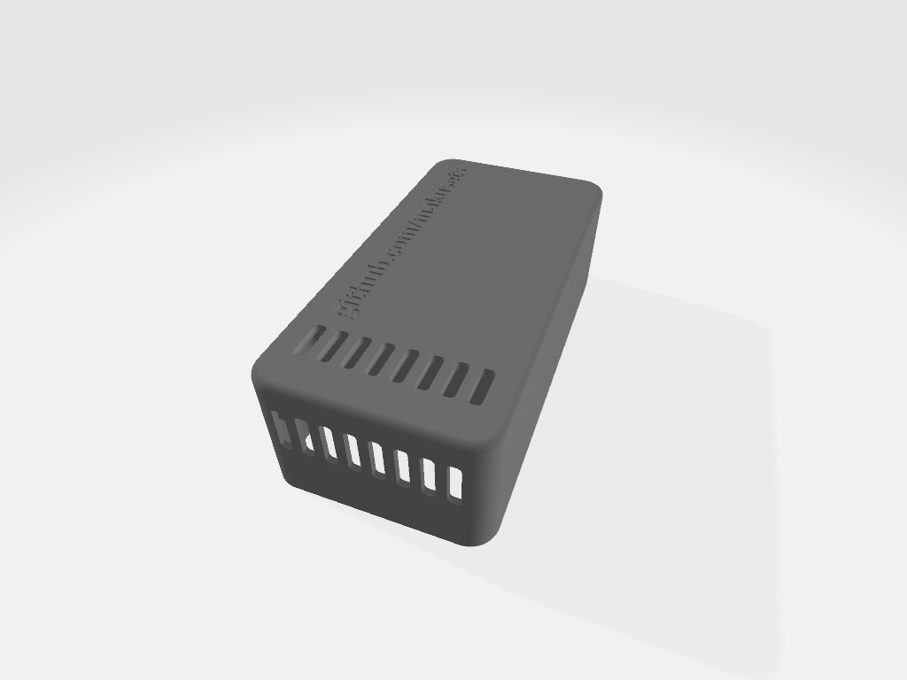
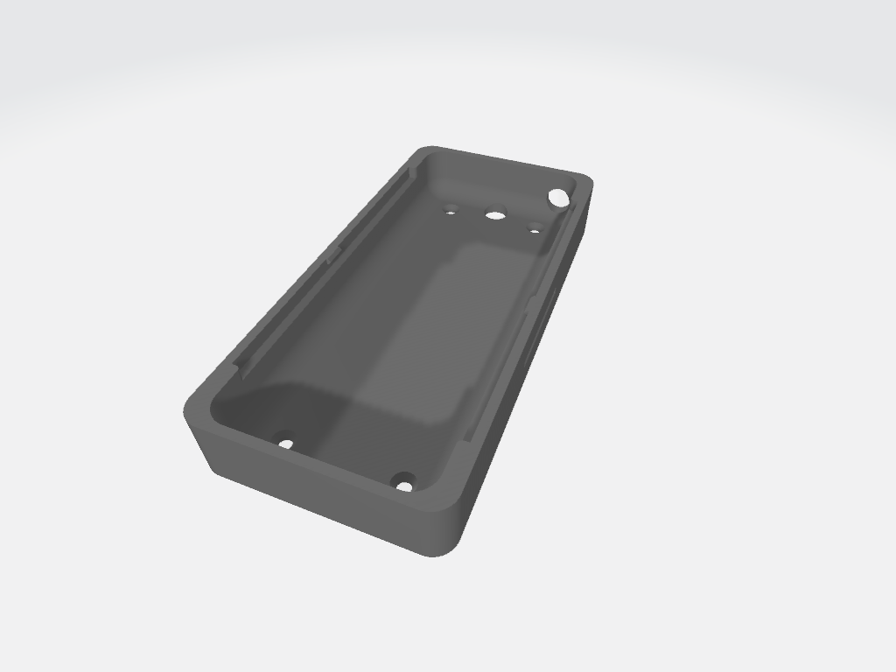

# Toshiba AB hardware guide

The Toshiba AB bus is not a TTL UART. A reader/writer interface is required
between the A/B terminals and the ESP8266. This repository includes complete
fabrication files for several board revisions in the [`hardware`](../hardware/)
directory.

## Select a board

| Board | Use | UART pins | Documentation |
| --- | --- | --- | --- |
| v3.2 | Recommended integrated ESP-12 board | TX GPIO12, RX GPIO13 | [Build files and assembly](../hardware/v3.2/README.md) |
| D1 mini | Simpler modular board | TX D8, RX D7 | [Build files and assembly](../hardware/D1%20mini/README.md) |
| v3 | Previous integrated board | TX GPIO10, RX GPIO13 | [Build files and assembly](../hardware/v3/README.md) |
| v1 | Original board; polarity-sensitive AB input | TX GPIO15, RX GPIO13 | [Build files and assembly](../hardware/v1/README.md) |

Each board directory contains the available schematic, Gerbers, bill of
materials, pick-and-place data and/or editable EasyEDA project.

## Design

The v3/v3.2 design accepts the voltage range found on the AB line, filters power
and data noise, reads data through DC filtering and a comparator, and writes a
zero bit by pulling A toward B through a resistor, as Toshiba controllers do.
The bridge input makes these revisions insensitive to A/B polarity.

Wi-Fi current peaks are considerably higher than those of a wall controller.
For that reason the board uses a buck converter rather than only an LDO, followed
by a low-noise 3.3 V LDO and a large rail capacitor. The tested DEXU K7803-500 and
K7803-1000 converters work well. Component substitution—especially the buck
converter or filter capacitors—can introduce enough noise to corrupt AB traffic.

The I²C header supports an optional BME280 temperature, humidity and pressure
sensor, or another ESPHome-compatible I²C device.

## Building and first flash

1. Choose a board above and read its revision-specific README.
2. Upload its Gerber archive to a PCB fabricator. If ordering assembly, also
   supply that revision's BOM and pick-and-place file and verify component
   orientation in the fabricator's 3D preview.
3. Fit any through-hole capacitors or modules omitted by the assembly service.
4. For the first ESPHome flash, select **USB** power and connect USB. On v3.2,
   hold **BOOT** while applying USB power to enter flashing mode if necessary.
5. After the initial flash, normal updates can be installed over the air.

Never change the power selector while the board is powered. Disconnect both USB
and the AB line before moving the jumper or switch.

## Installation

> The indoor unit and wired controller may contain hazardous voltages nearby.
> Isolate the complete HVAC system at the distribution board before opening it.

1. Flash and validate the ESPHome board before connecting the AB line.
2. Completely isolate power to the HVAC system.
3. Remove the wired controller cover and loosen its A/B terminal screws, or use
   the unit's documented AB connection point.
4. Wire A and B to the PCB. v1 is polarity-sensitive; v3 and v3.2 can be connected
   either way.
5. With USB disconnected, select **AB** power on boards that have a selector.
6. Reassemble the controller, restore HVAC power and inspect ESPHome logs for
   valid frames before sending commands.

The project emulates another wired controller. Address limits and coexistence
rules vary by system; avoid forcing addresses unless the normal auto-addressing
behavior does not work.

## Enclosure

A two-part printable enclosure is included in [`hardware/v3`](../hardware/v3/).
The v3.2 board fits the same case. STL files are ready for printing, and the
public Onshape source can be found by searching for `toshiba_esp_case` in
Onshape.

 

## Next steps

Return to the [main README](../README.md) to select air-to-air or hydronic setup,
then use the correct UART parity and frame format for your system. Technical
protocol information is kept separately in
[`docs/frame_formats.md`](frame_formats.md).
