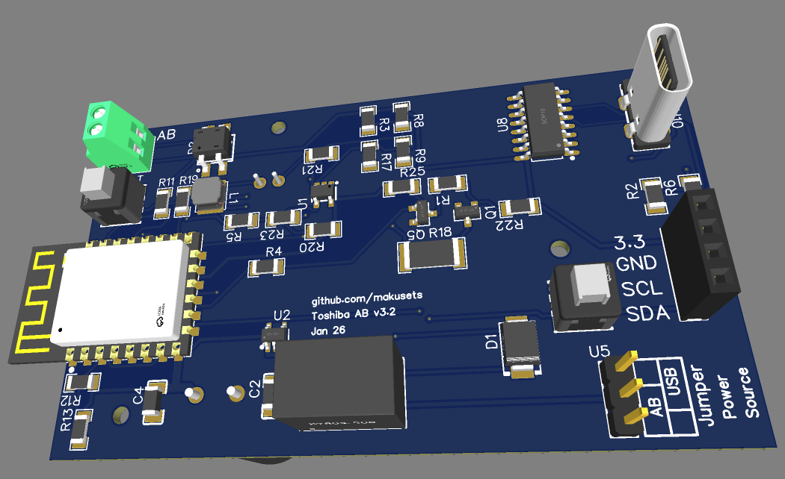

# v3.2 Jan 2026
# Ordering or building the board

You will need to build the compatible hardware. This folder contains all necessary files. I designed the board using EasyEDA online editor (free). All files are EasyEDA compatible format.
easyEDA_project.zip file can be imported onto EasyEDA editor to open the project with schematics and board design, make sure you use the 3.2 version once the project has been imported.

Alternatively, you can order the board from places like JLCPCB. You will need the 3 files included:

  - Gerber_v3_2.zip: This is the gerber file for the physical design of the board, if you only one the board made, that's all you need.
  - BOM_v3_2.csv: Contains the list of components (BOM). (needed if you want the full circuit board populated)
  - PaP_v3_2.csv: The information on where to place the component on the board. (needed if you want the full circuit board populated)

When ordering, make sure all the components that you want included are selected in the list.
I placed the electrolytic capacitors on the bottom side, so this will typically not be mounted if you are ordering the board from JLCPCB or similar. These are easily sourced and soldered by hand.
Use the 3D view to double check that all components appear on the board in the right orientation.

Alternatively, import easyEDA_project.zip and adjust it project to your needs. 

## Component shortfall

It often happens that components are out of stock or become unavailable and need to be replaced when uploading the BOM file. If you are not comfortable in doing so,
JLCPCB have the option of "parts sourced by JLCPCB" instead of "by customer". That should make it easy to replace shortfalls. Otherwise, use the search option and look for an equivalent component, AI is your friend and can help you find equivalent parts if in doubt. The 3D view on the next page can be useful to double check that you made the right choice and if any component needs to be reoriented.
The K78xx DCDC buck is a critical component, the board works fine with a DEXU branded one, EVSUN not good as it introduces a lot of noise in the AB line. Have not tried other brands, if you do, let me know.

# DIY tips

The internet is full of electronics sodering instructional tips and videos. I have nothing to add there, but I believe the board can be built with a bit of practice and some basic equipment, including a good soldering iron.

I personally did not use any magnifying device, reflow oven, or special equipment.

The two big capacitors are meant to be soldered at the back of the board and bended on its side, the case was designed with this in mind.

# Schematic

This is the schematic of the board.

# Final product

This is how I installed it

      

