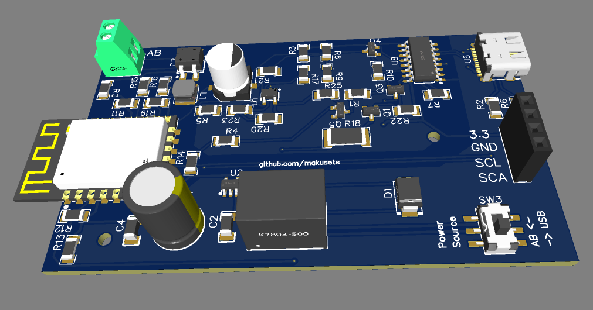

# v3 Board. Oct 2025
# Ordering or building the board

You will need to build the compatible hardware. This folder contains all necessary files. I designed the board using EasyEDA online editor (free). All files are EasyEDA compatible format.
v3_project_easyEDA.zip file can be imported onto EasyEDA editor to open the project with schematics and board design.

Alternatively, you can order the board from places like JLCPCB. You will need the 3 files included:

  - Gerber_v3.zip: This is the gerber file for the physical design of the board
  - BOM_v3.csv: Contains the list of components (BOM).
  - PickAndPlace_v3.csv: The information on where to place the component on the board.

When ordering, make sure all components are selected in the list (components that incur an extra fee, need to be manually ticked)
Use the 3D view to double check that all components appear on the board.

Alternatively, the file v3_project_easyEDA.zip contains a copy of the project that you can import into EasyEDA to edit. 

## Component shortfall

It often happens that components are out of stock or become unavailable and need to be replaced when uploading the BOM file. If you are not comfortable in doing so,
tick the option of "parts sourced by JLCPCB" instead of "by customer". That should make it easy to replace shortfalls. Otherwise, use the search option and look for an equivalent component. The 3D view on the next page can be useful to double check that you made the right choice.
The K78xx DCDC buck is a critical component, the board works fine with a DEXU branded one, EVSUN not good as it introduces noise in the AB line. Have not tried other brands, if you do, let me know.

# DIY tips

The internet is full of electronics sodering instructional tips and videos. I have nothing to add there, but I believe the board can be built with a bit of practice and some basic equipment, including a good soldering iron and possibly a hot air soldering gun to make it easier soldering the USB-C connector (or continue reading for options).

I personally did not use any magnifying device, reflow oven, or special equipment.

USB-C connector: this is the hardest bit to solder and I might be easier done with a hot air station. In any case, the connector is only there for the initial flashing of the firmware. Alternatively, one could flash the initial firmware on the ESP12 using a flashing board and get rid of the USB-C connector together with the USB to UART IC, the transistors and the resistorss. (U6, U8, R7, R10, R12, R11, Q3 and Q4). Updates can be done OTA once the board is up and running.

[USB-C programmer on AliExpress](https://www.aliexpress.com/item/1005007750007503.html)

# Schematic

This is the schematic of the board.

# Final product

This is how I installed it

      

